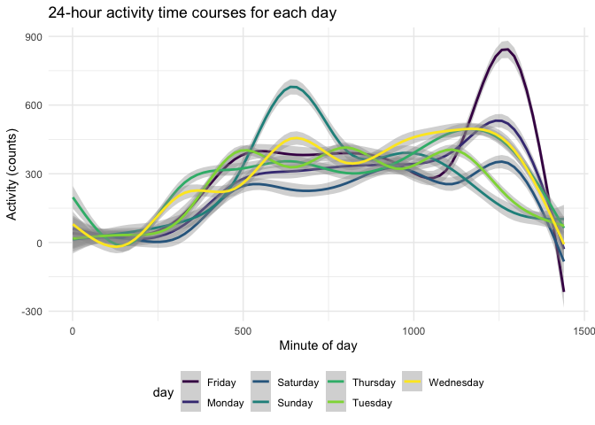

Homework 3 solutions
================
Yuanming Mao

## Problem 1

``` r
data("instacart")
```

This dataset contains 1384617 rows and 15 columns.

Observations are the level of items in orders by user. There are user /
order variables – user ID, order ID, order day, and order hour. There
are also item variables – name, aisle, department, and some numeric
codes.

  - How many aisles, and which are most items from?

<!-- end list -->

``` r
instacart %>% 
    count(aisle) %>% 
    arrange(desc(n))
```

    ## # A tibble: 134 x 2
    ##    aisle                              n
    ##    <chr>                          <int>
    ##  1 fresh vegetables              150609
    ##  2 fresh fruits                  150473
    ##  3 packaged vegetables fruits     78493
    ##  4 yogurt                         55240
    ##  5 packaged cheese                41699
    ##  6 water seltzer sparkling water  36617
    ##  7 milk                           32644
    ##  8 chips pretzels                 31269
    ##  9 soy lactosefree                26240
    ## 10 bread                          23635
    ## # … with 124 more rows

There are 134 aisles and most items are from fresh vegetables aisle.

  - Make a plot that shows the number of items ordered in each aisle,
    limiting this to aisles with more than 10000 items ordered. Arrange
    aisles sensibly, and organize your plot so others can read it.

<!-- end list -->

``` r
instacart %>% 
    count(aisle) %>% 
    filter(n > 10000) %>% 
    mutate(
        aisle = factor(aisle),
        aisle = fct_reorder(aisle, n)
    ) %>% 
    ggplot(aes(x = aisle, y = n)) + 
    geom_point() + 
    theme(axis.text.x = element_text(angle = 90, vjust = 0.5, hjust = 1))
```


  - Make a table showing the three most popular items in each of the
    aisles “baking ingredients”, “dog food care”, and “packaged
    vegetables fruits”. Include the number of times each item is ordered
    in your table.

<!-- end list -->

``` r
instacart %>% 
    filter(aisle %in% c("baking ingredients", "dog food care", "packaged vegetables fruits")) %>% 
    group_by(aisle) %>% 
    count(product_name) %>% 
    mutate(rank = min_rank(desc(n))) %>% 
    filter(rank < 4) %>% 
    arrange(aisle, rank) %>% 
    knitr::kable()
```

| aisle                      | product\_name                                 |    n | rank |
| :------------------------- | :-------------------------------------------- | ---: | ---: |
| baking ingredients         | Light Brown Sugar                             |  499 |    1 |
| baking ingredients         | Pure Baking Soda                              |  387 |    2 |
| baking ingredients         | Cane Sugar                                    |  336 |    3 |
| dog food care              | Snack Sticks Chicken & Rice Recipe Dog Treats |   30 |    1 |
| dog food care              | Organix Chicken & Brown Rice Recipe           |   28 |    2 |
| dog food care              | Small Dog Biscuits                            |   26 |    3 |
| packaged vegetables fruits | Organic Baby Spinach                          | 9784 |    1 |
| packaged vegetables fruits | Organic Raspberries                           | 5546 |    2 |
| packaged vegetables fruits | Organic Blueberries                           | 4966 |    3 |

  - Make a table showing the mean hour of the day at which Pink Lady
    Apples and Coffee Ice Cream are ordered on each day of the week;
    format this table for human readers (i.e. produce a 2 x 7 table).

<!-- end list -->

``` r
instacart %>% 
    filter(product_name %in% c("Pink Lady Apples", "Coffee Ice Cream")) %>% 
    group_by(product_name, order_dow) %>% 
    summarize(mean_hour = mean(order_hour_of_day)) %>% 
    pivot_wider(
        names_from = order_dow,
        values_from = mean_hour
    )
```

    ## `summarise()` regrouping output by 'product_name' (override with `.groups` argument)

    ## # A tibble: 2 x 8
    ## # Groups:   product_name [2]
    ##   product_name       `0`   `1`   `2`   `3`   `4`   `5`   `6`
    ##   <chr>            <dbl> <dbl> <dbl> <dbl> <dbl> <dbl> <dbl>
    ## 1 Coffee Ice Cream  13.8  14.3  15.4  15.3  15.2  12.3  13.8
    ## 2 Pink Lady Apples  13.4  11.4  11.7  14.2  11.6  12.8  11.9

## Problem 2

  - Load, tidy, and otherwise wrangle the data. Your final dataset
    should include all originally observed variables and values; have
    useful variable names; include a weekday vs weekend variable; and
    encode data with reasonable variable classes. Describe the resulting
    dataset (e.g. what variables exist, how many observations, etc).

<!-- end list -->

``` r
accel_data = 
  read.csv("./accel_data.csv") %>% 
  janitor::clean_names() %>% 
  mutate(weekday_vs_weekend = case_when(
    day %in% c("Monday", "Tuesday", "Wednesday", "Thursday", "Friday") ~ "weekday",
    day %in% c("Saturday", "Sunday") ~ "weekend"
  )) %>% 
  relocate(week, day_id, day, weekday_vs_weekend, everything()) %>%
  pivot_longer(
    activity_1:activity_1440,
    names_to = "minute",
    names_prefix = "activity_",
    values_to = "activity"
  ) %>% 
   mutate(
    day = factor(day),
    weekday_vs_weekend = factor(weekday_vs_weekend),
    minute = as.numeric(minute)
  ) 
```

The resulting dataset has 6 variables, including week number, day ID,
weekday or weekend, day name, minute of that day, and activity of that
minute. There are 5 weeks, 7 days for each week, and 1440 minutes for
each day. For each minute, we have the corresponding activity data. In
total, we have 50400 observations.

  - Traditional analyses of accelerometer data focus on the total
    activity over the day. Using your tidied dataset, aggregate across
    minutes to create a total activity variable for each day, and create
    a table showing these totals. Are any trends apparent?

<!-- end list -->

``` r
accel_data %>%
  mutate(
    day_num = case_when(
      day == "Monday" ~ 1,
      day == "Tuesday" ~ 2,
      day == "Wednesday" ~3,
      day == "Thursday" ~4,
      day == "Friday" ~5,
      day == "Saturday" ~6,
      day == "Sunday" ~7
      ),
    day = forcats::fct_reorder(day,day_num)
  ) %>% 
  group_by(week,day) %>% 
  summarize(activity_day = sum(activity)) %>%
  pivot_wider(
    names_from = day,
    values_from = activity_day
  ) %>% 
  knitr::kable(digits = 2)
```

    ## `summarise()` regrouping output by 'week' (override with `.groups` argument)

| week |    Monday |  Tuesday | Wednesday | Thursday |   Friday | Saturday | Sunday |
| ---: | --------: | -------: | --------: | -------: | -------: | -------: | -----: |
|    1 |  78828.07 | 307094.2 |    340115 | 355923.6 | 480542.6 |   376254 | 631105 |
|    2 | 295431.00 | 423245.0 |    440962 | 474048.0 | 568839.0 |   607175 | 422018 |
|    3 | 685910.00 | 381507.0 |    468869 | 371230.0 | 467420.0 |   382928 | 467052 |
|    4 | 409450.00 | 319568.0 |    434460 | 340291.0 | 154049.0 |     1440 | 260617 |
|    5 | 389080.00 | 367824.0 |    445366 | 549658.0 | 620860.0 |     1440 | 138421 |

From the table, we can see the trend that the activity on Tuesdays and
Wednesdays are quite stable, maintaining at the range from 300,000 to
470,000 counts. On other days, the activities are not that stable with
some apparently lower or higher values in certain weeks.

  - Accelerometer data allows the inspection activity over the course of
    the day. Make a single-panel plot that shows the 24-hour activity
    time courses for each day and use color to indicate day of the week.
    Describe in words any patterns or conclusions you can make based on
    this graph.

<!-- end list -->

``` r
accel_data %>%
  ggplot(aes(x = minute, y = activity, color = day)) +
  geom_smooth() +
  labs(
    title = "24-hour activity time courses for each day",
    x = "Minute of day",
    y = "Activity (counts)"
  )
```

    ## `geom_smooth()` using method = 'gam' and formula 'y ~ s(x, bs = "cs")'



According to the graph, we can see the trend that across days of weeks,
highest amounts of activities are typically around 300 to 500 counts
during 8 AM to 9 PM, and drop drastically until next morning. For
Sunday, the activity is extremely high at around 11 AM, peaked at about
700 counts. For Friday, the activity is extremely high at around 10 PM,
peaked at about 800 counts.

## Problem 3

``` r
library(p8105.datasets)
data("ny_noaa")
```

This dataset contains weather records from weather stations around the
world. It contains several daily variables, including maximum and
minimum temperature, total daily precipitation, snowfall, and snow
depth.The dataset has 7 columns and 2595176rows. 145838 of the stations
didn’t report precipitation, 381221 of the stations didn’t report
snowfall, 591786 of the stations didn’t report snow depth, 1134358 and
1134420 of the stations didn’t report maximum abd minumin temperature,
respectively. Therefore, the resulting dataset contains extensive
missing data, which could be an issue for data interpretation.

  - data cleaning. Create separate variables for year, month, and day.
    Ensure observations for temperature, precipitation, and snowfall are
    given in reasonable units.

<!-- end list -->

``` r
noaa_df = 
  ny_noaa %>% 
  separate(date, into = c("year", "month", "day"), remove = TRUE, convert = TRUE) %>% 
  mutate(
    tmin = as.numeric(tmin),
    tmax = as.numeric(tmax),
    prcp = prcp / 10,
    tmax = tmax / 10,
    tmin = tmin / 10
  )
```

  - For snowfall, what are the most commonly observed values? Why?

<!-- end list -->

``` r
noaa_df %>% 
  count(snow) %>% 
  drop_na(snow) %>% 
  mutate(snow_rank = min_rank(desc(n))) %>% 
  filter(snow_rank < 4)
```

    ## # A tibble: 3 x 3
    ##    snow       n snow_rank
    ##   <int>   <int>     <int>
    ## 1     0 2008508         1
    ## 2    13   23095         3
    ## 3    25   31022         2

For snowfall, the most commonly observed values are 0 mm, 25 mm, and 13
mm, probably because most reported areas have no snowfall, and mild
snowfalls are most common for areas that reported snowfalls.

  - Make a two-panel plot showing the average max temperature in January
    and in July in each station across years. Is there any observable /
    interpretable structure? Any outliers?

<!-- end list -->

``` r
noaa_df %>% 
  filter(month %in% c(1, 7)) %>% 
  mutate(month_name = case_when(
    month == 1 ~ "Janurary",
    month == 7 ~ "July"
  )) %>% 
  group_by(id, year, month_name) %>% 
  drop_na(tmax) %>% 
  summarize(mean_tmax = mean(tmax)) %>%
  ggplot(aes(x = year, y = mean_tmax, color = id)) +
  theme(legend.position = "none") +
  geom_point() +
  geom_line() +
  facet_grid(. ~ month_name) +
  labs(
    title = "Average maximum temperature in January and in July in each station across years",
    x = "Time (year)",
    y = "Mean Maxiumum temperature (C)"
  )
```

    ## `summarise()` regrouping output by 'id', 'year' (override with `.groups` argument)


The average maximum temperatures in Janurary across years are around -10
C to 10 C, which are apparently lower than those in July that are around
20 C to 30 C. One station had an extremely low mean maximum temperature
at about 14 C in July of the year around 1988.

  - Make a two-panel plot showing (i) tmax vs tmin for the full dataset
    (note that a scatterplot may not be the best option); and (ii) make
    a plot showing the distribution of snowfall values greater than 0
    and less than 100 separately by year.

<!-- end list -->

``` r
tmax_tmin_plot = 
  noaa_df %>% 
  ggplot(aes(x = tmin, y = tmax)) +
  geom_hex() + 
  labs(
    title = "Daily minimum temperature vs minimum temperature",
    x = "Minimum daily temperature (C)",
    y = "Maxiumum daily temperature (C)"
  )

snow_plot = 
  noaa_df %>% 
  filter(snow > 0 & snow < 100) %>% 
  mutate(year = as.character(year)) %>% 
  ggplot(aes(x = snow, y = year)) +
  geom_density_ridges() +
  labs(
    title = "Distribution of snowfall values greater than 0 and less than 100 by year",
    y = "Time (year)",
    x = "Snowfall (mm)"
    )

tmax_tmin_plot + snow_plot
```

    ## Warning: Removed 1136276 rows containing non-finite values (stat_binhex).

    ## Picking joint bandwidth of 3.76


